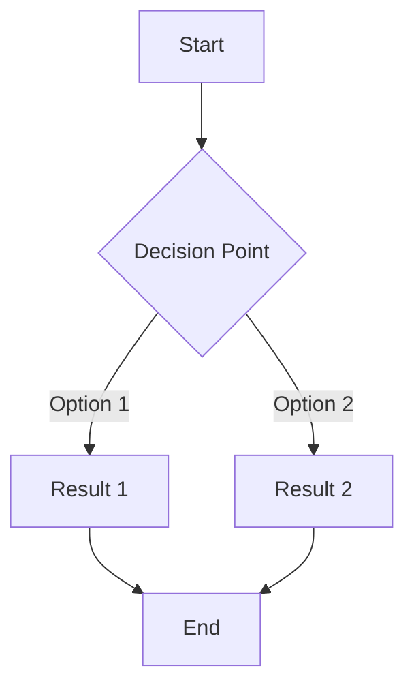

# AI Discovery Cards Facilitator

This is a simple facilitator and a representative of a company for an AI Discovery Cards training. It runs on [Chainlit](https://chainlit.io/).

## Prerequisites

- Python 3.12
- Azure OpenAI account with deployed models
- Git (for cloning the repository)

## Installation

1. **Clone the repository**:

   ```bash
   git clone <repository-url>
   cd DiscoveryCardsAgent
   ```

2. **Install dependencies**:

   ```bash
   cd src
   pip install -r requirements.txt
   ```

3. **Configure authentication**:
   Rename the file [src/config/auth-config-example.yaml](src/config/auth-config-example.yaml) to `src/config/auth-config.yaml` and create users and passwords. This is a simple example, so we are not providing a secure authentication mechanism, nor a user maintenance interface.
4. **Configure pages and agents**:
   Rename the file [src/config/pages-example.yaml](src/config/pages-example.yaml) to `src/config/pages.yaml` to use the example configuration, or customize it to your needs.

5. **Set up environment variables**:

   ```bash
   export AZURE_OPENAI_ENDPOINT="your-azure-openai-endpoint"
   export AZURE_OPENAI_API_VERSION="2024-02-01"
   ```

6. **Run the application**:
   ```bash
   chainlit run chainlit_app.py
   ```

## Deployment

In the [infra](./infra) folder, you can find the bicep template to deploy the application to Azure. It includes:

- An Azure App Service to host the Chainlit application
- An Azure OpenAI resource for AI model access

This has been developed with the Azure Developer CLI, which simplifies the deployment process. You can deploy it using the following command from the root of the repository:

```bash
azd up
```

## Configuration

### Authentication

The `auth-config.yaml` file contains the user authentication settings. See the example file for details.

### Pages and Agents

The application uses a unified YAML configuration in `pages.yaml` that defines both agents and pages:

1. **Agents**: Each agent has:
   - `persona`: Path to the persona prompt file that defines its behavior
   - `document` or `documents`: One or more document files that provide grounding/context
   - `model`: The AI model to use (e.g., "gpt-4o", "gpt-4o-mini")
   - `temperature`: Temperature setting for response generation (0.0-2.0)
2. **Pages**: Each page references an agent and defines:
   - Navigation properties (title, icon, URL path)
   - Display properties (header, subtitle)
   - Access control (admin_only flag)

### Agent Configuration Options

**Single Agent Configuration**:

```yaml
agents:
  my_agent:
    persona: prompts/my_persona.md
    document: prompts/my_document.md # Single document
    model: gpt-4o
    temperature: 0.7
```

**Multi-Document Agent Configuration**:

```yaml
agents:
  multi_doc_expert:
    persona: prompts/facilitator_persona.md
    documents: # Multiple documents
      - prompts/first_document.md
      - prompts/second_document.md
    model: gpt-4o-mini
    temperature: 1.0
```

**Graph Agent Configuration** (for conditional routing):

```yaml
agents:
  routing_agent:
    condition: "Analyze the input and decide which agent to route to"
    agents:
      - agent: "expert_agent"
        condition: "expert"
      - agent: "basic_agent"
        condition: "basic"
    model: gpt-4o
    temperature: 0.5
```

**Supervisor Agent Configuration** (for task delegation):

```yaml
agents:
  supervisor_agent:
    workers:
      - worker1
      - worker2
      - worker3
    delegation_prompt: |
      You are a supervisor that coordinates multiple worker agents.
      Analyze the request and delegate to the appropriate worker.
      Available workers: worker1, worker2, worker3
      Response format:
      WORKER: [worker_name]
      REASON: [explanation]
    model: gpt-4o
    temperature: 0.3
```

**ReAct Agent Configuration** (for reasoning and acting):

```yaml
agents:
  react_agent:
    react_persona: prompts/my_persona.md
    model: gpt-4o
    temperature: 0.7
    max_iterations: 3
```

## Mermaid Diagram Support

The application supports rendering Mermaid diagrams directly in chat responses. When the AI generates responses containing Mermaid diagram code blocks, they will be automatically rendered as visual diagrams.

Example of a Mermaid diagram in a response:

````markdown
Here's a simple workflow:



The diagram above shows a simple decision flow.
````

The application will detect the Mermaid code blocks and render them as diagrams while preserving the rest of the response's markdown formatting.

## GitHub Actions Deployment: Required Variables and Secrets

To enable automated deployment to Azure using GitHub Actions and managed identity federation, you must configure the following repository variables and secrets:

### Required GitHub Repository Variables

- `AZURE_CLIENT_ID`: The client ID of the Azure AD application (service principal) used for federated authentication.
- `AZURE_TENANT_ID`: The Azure Active Directory tenant ID.
- `AZURE_SUBSCRIPTION_ID`: The Azure subscription ID where the resources will be deployed.
- `AZURE_ENV_NAME`: The name of the Azure Developer CLI environment (if used in your workflow).
- `AZURE_LOCATION`: The Azure region/location for resource deployment (e.g., "westeurope").

### Required GitHub Repository Secrets

- `AUTH_CONFIG_YAML`: The full YAML content for `src/config/auth-config.yaml` (used to provide authentication configuration securely at deploy time).
- `AZURE_CREDENTIALS` (optional): Only required if not using OIDC federation. For managed identity federation, this is not needed.

### Managed Identity Federation Setup

This workflow uses GitHub's OpenID Connect (OIDC) integration to authenticate to Azure without storing long-lived credentials. Ensure you have:

1. Created an Azure AD application (service principal) with federated credentials for your GitHub repository.
2. Assigned the necessary roles (e.g., Contributor) to the service principal in your Azure subscription.
3. Configured the federated credential in Azure AD to trust your GitHub repository and workflow.

For more details, see the [official Microsoft documentation on OIDC and federated credentials](https://learn.microsoft.com/azure/developer/github/connect-from-azure?tabs=azure-cli%2Clinux&pivots=identity-fed).

---
