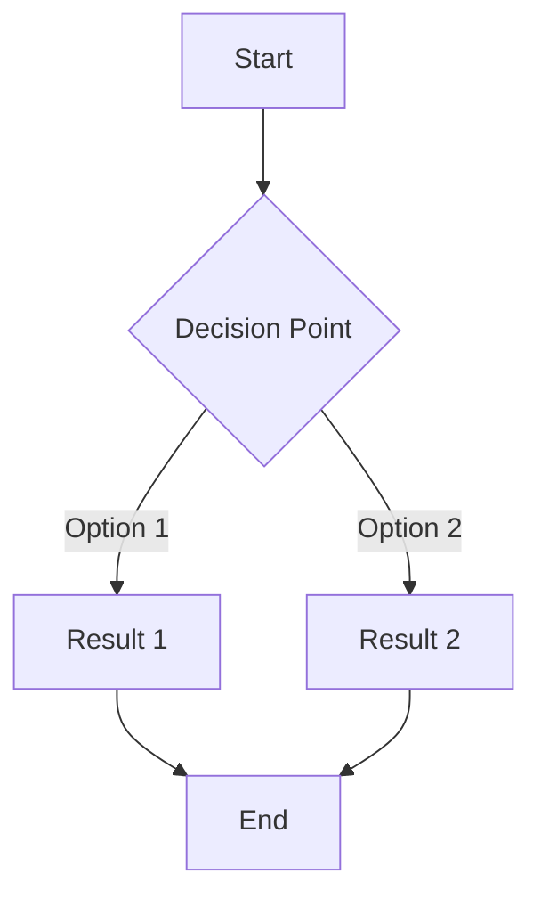

# AI Discovery Cards Facilitator

This is a simple facilitator and a representative of a company for an AI Discovery Cards training. It runs on Streamlit and uses a simple authentication system.

## Installation

Rename the file [src/config/auth-config-example.yaml](src/config/auth-config-example.yaml) to `src/config/auth-config.yaml` and change the password. The username is `admin` and the password is `admin`. You can change it to whatever you want.

Rename the file [src/config/pages-example.yaml](src/config/pages-example.yaml) to `src/config/pages.yaml` to use the example configuration, or customize it to your needs.

## Configuration

### Authentication

The `auth-config.yaml` file contains the user authentication settings. See the example file for details.

### Pages and Agents

The application uses a unified YAML configuration in `pages.yaml` that defines both agents and pages:

1. **Agents**: Each agent has:
   - A persona prompt file that defines its behavior
   - One or more document files that provide grounding/context
   
2. **Pages**: Each page references an agent and defines:
   - Navigation properties (title, icon, URL path)
   - Display properties (header, subtitle)
   - Access control (admin_only flag)

### Multiple Document Support

Agents can now be grounded in multiple documents:

```yaml
agents:
  multi_doc_expert:
    persona: prompts/facilitator_persona.md
    documents:
      - prompts/first_document.md 
      - prompts/second_document.md
```

This allows creating more capable agents with access to multiple knowledge sources.

## Mermaid Diagram Support

The application supports rendering Mermaid diagrams directly in chat responses. When the AI generates responses containing Mermaid diagram code blocks, they will be automatically rendered as visual diagrams.

Example of a Mermaid diagram in a response:

````markdown
Here's a simple workflow:



The diagram above shows a simple decision flow.
````

The application will detect the Mermaid code blocks and render them as interactive diagrams while preserving the rest of the response's markdown formatting.

