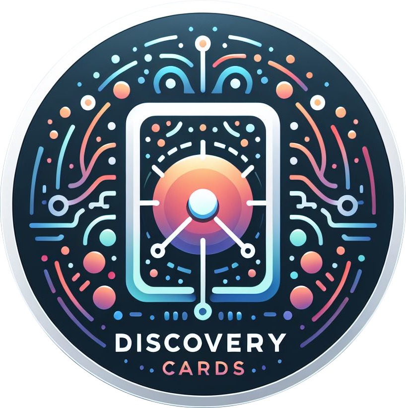
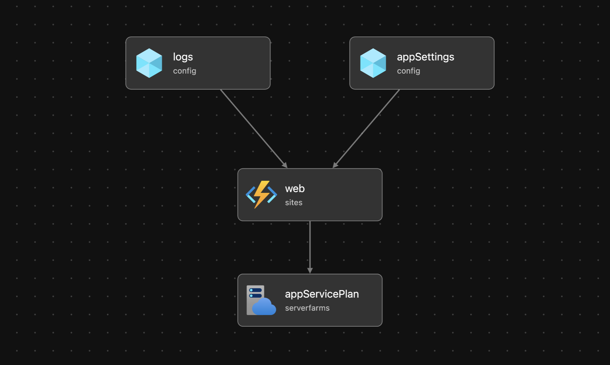

# AI Discovery Cards Facilitator



A comprehensive web application designed to facilitate AI Discovery Cards workshops. This tool provides interactive guidance through the AI discovery process, helping teams brainstorm and explore AI solutions for business challenges.

## Overview

The AI Discovery Cards Facilitator is a Streamlit-based application that:

- Guides workshop participants through the AI discovery process
- Provides different AI personas to interact with (facilitator, customer representatives)
- Helps generate and evaluate AI solution ideas
- Offers a structured approach to AI ideation and prioritization

The application uses Azure OpenAI services to power the conversational agents and is designed to be deployed to Azure App Service.

## Architecture



The application consists of several key components:

- **Streamlit Frontend**: User interface for interacting with the agents
- **Agent Core**: Manages agent instantiation and LLM interactions
- **Configuration System**: YAML-based configuration for authentication and page structure
- **Azure Infrastructure**: App Service and Azure OpenAI resources

## Prerequisites

- Python 3.12 or higher
- Azure subscription with access to Azure OpenAI
- Azure Developer CLI (azd) for deployment

## Local Development Setup

1. Clone the repository:
   ```bash
   git clone https://github.com/yourusername/DiscoveryCardsAgent.git
   cd DiscoveryCardsAgent
   ```

2. Create a virtual environment and install dependencies:
   ```bash
   python -m venv .venv
   source .venv/bin/activate  # On Windows: .venv\Scripts\activate
   pip install -r src/requirements.txt
   ```

3. Configure the application:
   - Rename `src/config-example.yaml` to `src/config.yaml` and update the credentials
   - Rename `src/pages-example.yaml` to `src/pages.yaml` or customize to your needs
   - Set up the required environment variables:
     ```bash
     export AZURE_OPENAI_ENDPOINT=https://your-openai-resource.openai.azure.com/
     export AZURE_OPENAI_DEPLOYMENT_NAME=gpt-4o  # Or your deployment name
     ```

4. Run the application locally:
   ```bash
   cd src
   streamlit run streamlit_app.py
   ```

## Configuration

### Authentication

The `config.yaml` file contains the user authentication settings:

```yaml
credentials:
  usernames:
    admin:
      email: username@domain.com
      password: your-secure-password  # Will be automatically hashed on first run
      roles:
        - admin
        - editor
        - viewer
```

> **⚠️ Security Warning**: Never use the default admin/admin credentials in production. Always change the password to a strong, unique value.

### Pages and Agents

The application uses a unified YAML configuration in `pages.yaml` that defines both agents and pages:

1. **Agents**: Each agent has:
   - A persona prompt file that defines its behavior
   - One or more document files that provide grounding/context
   
2. **Pages**: Each page references an agent and defines:
   - Navigation properties (title, icon, URL path)
   - Display properties (header, subtitle)
   - Access control (admin_only flag)

### Multiple Document Support

Agents can be grounded in multiple documents:

```yaml
agents:
  multi_doc_expert:
    persona: prompts/facilitator_persona.md
    documents:
      - prompts/first_document.md 
      - prompts/second_document.md
```

This allows creating more capable agents with access to multiple knowledge sources.

## Azure Deployment

The project includes Azure infrastructure definitions using Bicep and can be deployed using the Azure Developer CLI (azd).

1. Login to Azure:
   ```bash
   az login
   ```

2. Initialize the Azure Developer CLI environment:
   ```bash
   azd init
   ```

3. Provision and deploy the application:
   ```bash
   azd up
   ```

This will create:
- Azure App Service for hosting the web application
- Azure OpenAI resource with GPT-4o and text-embedding-ada-002 deployments
- Associated resources like App Service Plan

## Customization

### Adding New Agents

1. Create new persona and document files in the `src/prompts` directory
2. Update `src/pages.yaml` to include the new agent definition
3. Add a new page entry in the appropriate section

### Modifying the Workshop Flow

The workshop flow is defined in the facilitator persona prompt (`src/prompts/facilitator_persona.md`). You can modify this file to adjust the workflow steps and guidance provided by the agent.

## Troubleshooting

### Common Issues

1. **Authentication Errors**: Ensure that the `config.yaml` file is properly formatted and located in the `src` directory.

2. **OpenAI Connection Issues**: Verify that your Azure OpenAI endpoint and deployment name are correctly configured as environment variables or in the Azure App Service configuration.

3. **Missing Pages**: Check that the `pages.yaml` file is properly formatted and that all referenced persona and document files exist.

## Security Considerations

- The application uses Streamlit's cookie-based authentication system
- For production use, consider additional security measures:
  - Use HTTPS only
  - Implement IP restrictions
  - Use Azure AD integration for authentication
  - Regularly rotate credentials

## License

This project is licensed under the terms of the license included in the repository.

## Contributing

Contributions are welcome! Please feel free to submit a Pull Request.

